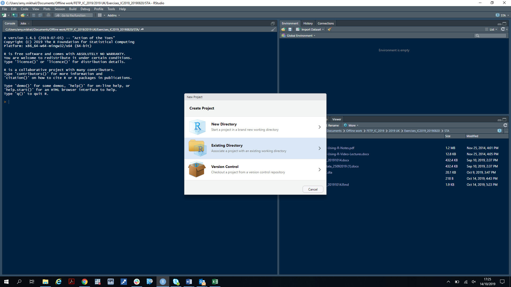
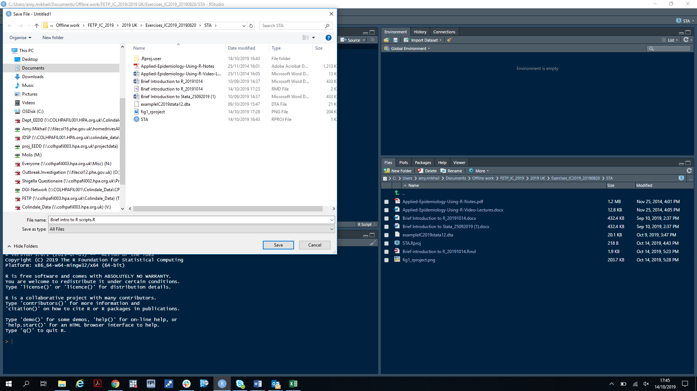

# Brief introduction to R

## Acknowledgements:

This brief introduction to R is based on a brief introduction to STATA written by Alicia Barrasa, EPIET scientific coordinator, for the EPIET/EUPHEM programme (2019 version).  The data set supplied is from an outbreak of gastrointestinal disease that occured at a secondary school following lunch at the school canteen.  Cases affected included mostly pupils and some teachers. The outbreak control team decided to conduct a cohort study and collected information on onset dates, symptoms and exposures for the three dishes on offer from all students and staff that attended the meal.


## Objectives:

 - To be familiar with the R environment
 - To be able to open, import and save files
 - To understand the use of R project files, R scripts and R markdown files
 - To use some R commands for describing and analysing an outbreak dataset


## 1. RStudio and R:

Nowadays, the program R is normally operated from a user-friendly interface called RSTudio.  RStudio has many useful features, including predictive text and bracket completion which help to simplify writing code.   Note that you will require both R and RStudio to be installed.  In this section, we will demonstrate the use of RStudio to:

 - set up an R project file (convenient anchor for your working directory)
 - create an R script
 - execute some R commands using basic syntax
 - work within R notebooks or R markdown documents
 
 
### 1.1 Setting up an R project file

It is good practice to create a new folder (directory) on your computer for each piece of analysis you want to undertake.  This folder should contain the dataset(s) you want to analyse.  It will also be the default location for exporting any outputs from your analysis.  In RStudio, you can create an R project file inside this directory, by going to `File` and  selecting `New Project` in the top menu bar and following the instructions to `create project in existing directory`.  When complete, you will be able to double click on the `.Rproj` file to open it and from there, open any R scripts, R markdown files or `.RData` files that you were working on and continue from where you left off.
The process is illustrated in figure 1.




### 1.2 Creating an R script

Now that we have set up an `.Rproj` file for our project, it would also be good practice to save our analysis commands in an R script.  These are analogous to a STATA do file.  To create a new R script, go to `File`, then `New file` and select `R script`.  Give this file a name, remembering to include the file ending `.R` as these are not automatically added by RStudio.  This process is demonstrated in Figure 2.




### 1.3 Creating an R markdown document


Some people prefer to integrate their code with outputs (figures, summary tables, analytical outputs etc.) by using an R markdown notebook instead.  This approach has more features as you can run separate 'chunks' of code and preview the result, or 'knit' the whole file into a document that serves as a record for your code and the output it produced.  This document is produced with an R markdown file.  You can read more about how to create R markdown files in [R markdown: the definitive guide](https://bookdown.org/yihui/rmarkdown/), an e-book produced by the RStudio developers.

\pagebreak

## 2. Example practice


### 2.1 Load relevant libraries:

In R, functions are bundled into units called 'packages' which usually focus on a specific topic or set of tasks.  You can choose what packages you want to install from the [Comprehensive R Archive Network (CRAN)](https://cran.r-project.org) which currently hosts over 10,000 packages.  Packages are stored in a `library` on the hard-drive of your computer; the ones you want to use need to be loaded from this library at the beggining of each R session.  It is good practice to load any packages you need at the top of your R script.  

Most package authors will make early (alpha) versions of their packages available to use or try out while still in development by depositing them in Github (available to everyone on the internet) or Gitlab (usually private to specific organisations) repositories.  PHE has its own Gitlab repository which staff can browse [here](https://gitlab.phe.gov.uk/users/sign_in) (note that these repositories are best viewed on Google Chrome - use your PHE user name and password to log in).

In this demonstration, we are going to use a package developed by UK FETP alum Daniel Gardiner, called EpiFunc. Daniel has stored this package on Github; you can view some information about the package including instructions on how to install it and example use [here](https://github.com/DanielGardiner/EpiFunc). 

If your R script is going to be used by other people, it is also good practice to add some lines in your script that check if the required packages are already in their library or if they need to be installed, and if so, install them.  We will do this before we load the packages in the next section.  Note that packages are installed by using the `install.packages(...)` command within R.


```{r setup, echo=TRUE, message=FALSE, results='hide'}

# List required CRAN packages to install:
pkglist <- c("devtools",
             "here", 
             "haven", 
             "data.table", 
             "lubridate", 
             "epitrix", 
             "ggplot2", 
             "epitools")

# Check if packages are already installed, if not install them:
if (!requireNamespace(c(pkglist), quietly = TRUE)) install.packages(c(pkglist))

# Check if EpiFunc (Github package) is installed, if not install it:
if (!requireNamespace("EpiFunc", quietly = TRUE)) devtools::install_github("DanielGardiner/EpiFunc")

```

Now that we have installed the packages we need, we can load them for this R session using the `library()` command.  If you are using a lot of different functions from a particular package, you will need to load it at the beggining of your script and run this line at the beggining of each R session to access the functions within it.  However, if you just need one or two functions from a package, you can call the functions using the format `package.name::function.name()` (which we will do in the next section).

We have quite a few packages to load; we could load them individually with lots of calls to the `library()` function, but this would take up many lines of code.  Fortunately, we already produced a list of the packages that we need, so we can loop through the list and apply the `library()` function to each package with the `lapply()` command.  `lapply()` is a function for looping through lists of objects in R.

The packages we need and their uses in this introduction are listed below:

 - `here`: locates your working directory in the folder where you created your `.Rproj` file
 - `haven`: imports STATA `.dta` datasets and other less common file types into R
 - `data.table`: data cleaning, recoding, reshaping and creating summary tables 
 - `lubridate`: performing calculations with dates
 - `epitrix`: create 2x2 epitables and other functions for cleaning epidemiological data
 - `ggplot2`: create graphs
 - `epitools`: calculate risk ratios
 - `EpiFunc`: create descriptive epidemiology figures (age sex pyramids and epicurves)
 

```{r load libraries, echo=TRUE, message=FALSE, results='hide'}

# Load a single package:
library(here)

# Alternatively, lets load all the packages in our list at the same time:
lapply(c(pkglist, "EpiFunc"), library, character.only = TRUE)

```


Lastly, we need to set our working directory before we can begin our analysis.  This is the directory that R will expect your data files to be in (unless you provide the full file path to another location).  This is also the place where any output you produce will be saved.  In this case we are going to use the `here` package to create a special tag in the directory that contains our `.Rproj` file.  This tag will set that folder to be the working directory.  This is a more useful approach than providing the full file path to your working directory, particularly if you are sharing your script with other people who will want to set up their working directory in a different location.

```{r set working directory, echo=TRUE, message=FALSE, results='hide'}

# Check the location of your current working directory:
getwd()

# If happy with this location, set a placeholder in the current directory:
here::set_here()

# Set the working directory relative to the location of the .here file you just created:
setwd(here::here())

```

\pagebreak

### 2.2 Import and view the data:

There are several functions you can use to import data; to import text or .csv (comma separated value) files you can use the 'base R' commands `read.txt(...)` or `read.csv(...)`, respectively.  In this example, the data has been stored in in a STATA .dta file, so we will use the `read.dta(...)` command from the haven package to import the data.

The R equivalent of the STATA `codebook` command is `str(...)` (short for 'structure') and shows you what variables are in your dataset and what format they are in.  We need to check that for example, dates are in the 'date' format before proceeding with our analysis so we will use the `str(...)` command to check this in the next section.

Because you can have several datasets loaded into your R environment at the same time, each dataset needs to be given a name when you import it.  When doing anything with that dataset (reshaping, recoding, performing calculations, creating figures etc.) you will need to refer to it by name.  In 'base R' if you want to refer to a specific variable within your dataset, you would do this by naming the dataset, followed by a dollar sign followed by the name of the variable of interest, e.g. `mydata$variable1`.  This can be tiring to write out over and over again.   Fortunately, there are two packages that help with this by modifying the syntax (grammatical structure of your R code) so that you can refer to the name of your dataset just once and perform a series of manipulations or calculations on it after that.  The two packages are `dplyr` and `data.table`.  Both are very useful in different situations; `data.table` has been designed for fast computation on large datasets.  In this demonstration, we are going to convert our dataset to a `data.table` so that we can take advantage of the simpler and more efficient syntax.


```{r import, echo=TRUE, message=FALSE}

# Import the data:
mydata <- haven::read_dta(file = "exampleIC2019stata12.dta")

# Convert to a data.table:
mydata <- data.table::data.table(mydata)


```

\pagebreak

### 2.3 Explore the data:

The next thing we want to do is explore our data.  Inevitably, we are likely to find some coding errors that will need correcting, or variables that need to be converted to another format before we can proceed with our analysis.

It might be informative to look at the first few rows of our data, which we can do with the `head()` command.

To browse the entire dataset, we can use the `View()` command which will open your dataset in a separate window within RStudio.  You can sort the columns (ascending or descending order) using the arrows at the top of the viewing window.

We can use the `str(...)` command to view more details on a specific variable.  In addition, the `summary(...)` command is useful for summarising numeric variables and the `table(...)` command is the R equivalent of STATA `tabulate`.  In the code below we will use square brackets to look at the structure of a subset of our data (the first four columns):

```{r explore, echo=TRUE, message=FALSE}

### Have a look at the data:

# View top 6 rows of data:
head(mydata)

# Browse the whole data set in the viewer:
View(mydata)

# Check if the class type of each variable is correct (e.g. dates should be date):
str(mydata[,1:4])

# Check that date variables are still correctly formatted:
lubridate::is.Date(mydata$onset)

```


It may also be useful to check that numeric and categorical variables have been coded or labelled correctly in our data.  To do this, we will first explore the numeric variable age:

```{r age, echo=TRUE, message=FALSE}

# Have a look at the structure of the age variable:
str(mydata$age)

# Summarise to get interquartile ranges:
summary(mydata$age)

# Tabulate to view the range of ages:
table(mydata$age, useNA = "always")

# Create a histogram to see this better:
hist(mydata$age, breaks = 6, freq = TRUE)

```

The distribution of ages shown in the histogram will be useful for determining appropriate age groups to display on an age sex pyramid.

While you are exploring your data, you may notice that the variable 'sex' has been encoded as '1' and '2'.  This may cause some confusion as it is not clear which is male and which is female.  In R, categorical variables are known as 'factors' and don't have to be encoded because R will automatically encode the labels when performing calculations.  For clarity, we can therefore recode sex as 'male' if equal to 1 and female otherwise, with the `ifelse(...)` command.  Note that care needs to be taken if there are missing values (coded as `NA` in R) since these should be excluded from the recoding.  We can check this by tabulating the variable sex and setting the `useNA` argument to `always` so that we can see if there are any missing values.


```{r sex, echo=TRUE, message=FALSE}

# Have a look at the structure of the binary variable sex:
str(mydata$sex)

# How are binary variables summarised?
summary(mydata$sex)

# How many of each sex category do we have?
table(mydata$sex, useNA = "always")

# Lets recode sex to make the outputs easier to read:
mydata[, sex := ifelse(sex == 1, "male", "female")]

```

\pagebreak

### 2.4 Create the case definition:

This dataset includes both cases and non-cases as it is a cohort study.  To distinguish between them, we need to create a new variable called `case` based on the case definition.  Cases must:

 - have a date of symptom onset
 - have reported suffering from diarrhoea OR vomiting
 
In the code below, we:

1. Identify all the variables relating to symptoms and put them in a list
2. Recode missing values in these variables from '9' to NA
3. Recode the symptom columns from 0 and 1 to TRUE / FALSE (R encoding for logical variables)
4. Define cases according to the case definition in a new variable
 
```{r case definition, echo=TRUE, message=FALSE}

# Lets group the symptom variables we need for our case definition:
symptoms <- c("fever", "vomiting", "diarrhoea", "abdpain")

# You notice missing records for fever have been encoded as 9 - in R these should be NA:
mydata[, (symptoms) := lapply(.SD, function(x) ifelse(x == 9, NA, x)), .SDcols = symptoms]

# Ideally these should be TRUE / FALSE as they are binary columns - lets change that:
mydata[, (symptoms) := lapply(.SD, function(x) as.logical(x)), .SDcols = symptoms]


# Now we want to create our case definition:
mydata[, case := ifelse(!is.na(onset) & (diarrhoea == TRUE | vomiting == TRUE), TRUE, FALSE)]

```


Note this case definition still leaves out some people whose clinical status or onset date is unknown, but we still have:

 - 88 cases
 - 297 non-cases

\pagebreak 

### 2.5 Descriptive analysis:

Now that the data has been cleaned, formatted and recoded, we can proceed with descriptive analysis.  It would be useful to create an epicurve and age sex pyramid, which we will do in the next section with functions from Daniel Gardiner's EpiFunc package.

Before proceeding, we will need to make a subset of the data that includes only cases.  We can do this with the `subset(...)` command, using conditional logic to select the cases.  We will call the subsetted data 'caseonly'.

We will create the epicurve stratified by sex using the PHE colour palatte, angeling the text to 90 degrees so that the x axis labels do not look too crowded and adding 2 days either side of the minimum and maximum onset dates using the `days()` function from the `lubridate` package to make the epicurve easier to read.  You can have a look at the other options (arguments) in the help file for the epicurve function with the command `?EpiFunc::epicurve`.  Note that you can refer to a specific function from a package in the form `package_name::function_name`.  This is sometimes useful when two different packages have functions with the same name.  It is also good practice to do this as it makes it easier to see what packages your code depends on.

```{r epicurve, echo=TRUE, message=FALSE}

# Subset the data to cases only:
caseonly <- subset(mydata, case == TRUE)


# Have a look at the help page for the epicurve function to see what the arguments are:
?EpiFunc::epicurve

# Create an epicurve:
epicurve1 <- EpiFunc::epicurve(x = caseonly, 
                               date.col = "onset", 
                               time.period = "day", 
                               start.at = min(caseonly$onset) - lubridate::days(2), 
                               stop.at = max(caseonly$onset) + lubridate::days(2), 
                               fill.by = "sex", 
                               xlab = "Date of onset", 
                               fill.by.legend.title = "Sex", 
                               angle = 90, 
                               col.pal = "phe", 
                               epi.squares = TRUE, 
                               blank.background = TRUE)

# Print the epicurve to view:
epicurve1

```

We will also create an age sex pyramid using the PHE colour palatte to denote males and females.  Before creating the figure, we will need to create some age groups using the `calc_agegroup()` function from the `EpiFunc` package.  This function creates age group as a type of variable known as `factor` in R.  Factors are for categorical data and by setting the factor levels, we can include categories that may be missing from our data (e.g. age groups needed to fill gaps in the age profile).  Note that there is no need to put the name of the variable in quotes inside the function argument, because we are applying the function to create a new variable within the existing data.table.  Careful consideration should be given to the break-points to use for age groups as this will have an impact on how the figure looks.  We have already seen from the histogram of age that most of the cases are students between the ages of 10 and 20, however there are some teachers affected as well.  The code below will split them into 5 age groups: 0 - 9, 10 - 15, 16 - 19, 20 - 49 and 50+ which is sensible given the age distribution in this data set.  Each number in the `breaks` argument represents the starting point for the next age group.

```{r agesex, echo=TRUE, message=FALSE}

# Create age groups:
caseonly[, agegroup := EpiFunc::calc_agegroup(age = age, breaks = c(0, 10, 16, 20, 50, Inf))]

# Check that each age has been assigned to the correct age group by viewing them in a table:
table(caseonly$age, caseonly$agegroup)

# Have a look at the arguments for the age sex pyramid function in the help file:
?EpiFunc::age_sex_pyramid

# Create an age sex pyramid:
agesex <- EpiFunc::age_sex_pyramid(data = caseonly,
                                   age.grp.col = "agegroup", 
                                   sex.col = "sex", 
                                   col.pal = "phe", 
                                   blank.background = TRUE)

# Print the age sex pyramid to view:
agesex

```

\pagebreak

### 2.6 Calculate risk ratios for exposures:

In the last section, we will calculate and compare risk ratios for the three exposures using the `riskratio()` function from the `epitools` package.  For this analysis we will use the full dataset that contains both cases and non-cases and look at the following exposures:

 - pasta
 - meat
 - fish
 
In the output, 'predictor' is the exposure (pasta, meat or fish) and 'outcome' is whether or not a case became ill (cases = `TRUE` and non-cases = `FALSE`).  If the risk ratio is less than 1 (including both lower and upper confidence limits), this means the exposure is protective against becoming ill.  If the lower and upper confidence limits cross 1, this means there is no statistical association between the exposure and becoming ill (or not being ill).  If the risk ratio (and both lower and upper confidence limits) are above 1, this means the exposure is associated with the risk of becoming ill. 

First we will use the native `lapply` function to loop across the three exposure variables and convert them to logical format (TRUE / FALSE).

```{r exposures, echo=TRUE, message=FALSE}

# Lets group the exposures:
exposures <- c("pasta", "fish", "meat")

# Lets recode them as TRUE / FALSE:
mydata[, (exposures) := lapply(.SD, function(x) as.logical(x)), .SDcols = exposures]

```


Next, we will calculate the risk ratio for **pasta**:

```{r pasta risk ratio}

# Lets get the risk ratio for pasta:
pastarr <- epitools::riskratio(as.factor(mydata$pasta), as.factor(mydata$case))

# Print the results to view:
pastarr


```


... and for **fish**:

```{r fish risk ratio}

# And for fish:
fishrr <- epitools::riskratio(as.factor(mydata$fish), as.factor(mydata$case))

# Print the results to view
fishrr

```


... and for **meat**:

```{r meat risk ratio}

# And for meat:
meatrr <- epitools::riskratio(as.factor(mydata$meat), as.factor(mydata$case))

# Print the results to view:
meatrr

```


We can see from these results (look at the `measure` component) that the risk of being ill is weakly associated with pasta (the risk ratio of the lower confidence limit is just above 1), not associated with consuming fish (the confidence intervals cross 1) and strongly associated with consuming meat (the risk of becoming ill is 2.25 times higher in those who ate meat compared to those who did not).

Because the association with consumption of pasta is weaker, it would be useful to investigate whether pasta is a confounder - for instance the majority of people who ate pasta may also have eaten the meat.  To test this, we can calculate the risk ratio for pasta again, this time stratifying by exposure to meat.  We can do this by only calculating risk ratios for the subset of cases that did not eat meat with their pasta, using the square brackets `[...]` to enclose the logical condition to subset on (`meat == FALSE`).

```{r risk ratio for pasta stratified by meat consumption}

# Have a look at a two by two table of pasta and meat consumption for cases:
table(mydata$pasta[mydata$case == TRUE], mydata$meat[mydata$case == TRUE])

# ... and for non-cases:
table(mydata$pasta[mydata$case == FALSE], mydata$meat[mydata$case == FALSE])

# ... and for the whole cohort:
table(mydata$pasta, mydata$meat, useNA = "always")

# Calculate the risk ratio for people that ate pasta but not meat:
pasta_no_meat <- epitools::riskratio(as.factor(mydata$pasta[mydata$meat == FALSE]), 
                                     as.factor(mydata$case[mydata$meat == FALSE]))

# Print the results to view:
pasta_no_meat

```


We can see that over half of the cohort ate both pasta and meat (**`r round((225/404)*100, 0)`%**) and that the confidence intervals for the pasta risk ratio now crosses 1 (i.e. is no longer significant) when people who ate meat are excluded. From this, we can conclude that the vehicle of infection in this outbreak was most likely meat; we could then go on to calculate an adjusted risk ratio with the Mantel Haenszel test and / or construct a multivariable model (these procedures will be covered in more detail in the outbreak and multivariable analysis modules). 

Another excellent case study that demonstrates the processes shown here in R is the **Stegen outbreak** case study developed by the R epidemics consortium's RECONlearn initiative.  You can access this case study on the RECONlearn website [here](https://www.reconlearn.org/post/stegen.html).


